https://architectu-studio.aura.build/
**What I like**: one of my favorites out of any site ive ever seen, super clean and minimalistic with heavy scroll
**Use for**: Landing pages, agency and company sites
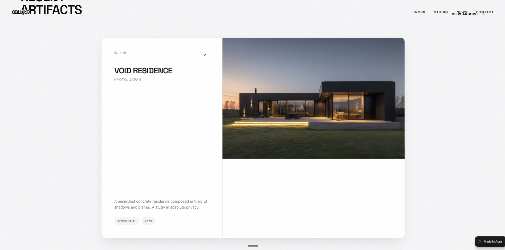

**URL**: https://lumen-portfolio.aura.build/
**What I like**: Clean structured site with nice pacing
**Use for**: Landing pages, SaaS sites
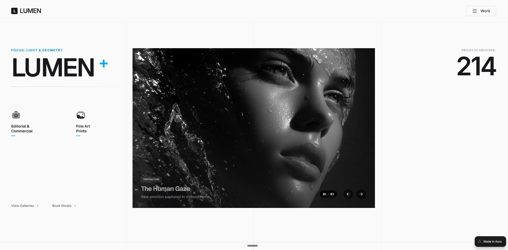

https://ventus-agency.aura.build/
**What I like**: super clean minimalistic white site
**Use for**: Landing pages, agency sites, extract sections for inspiration
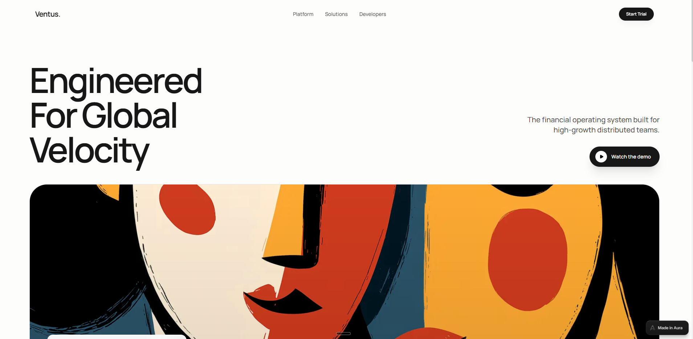

https://ecommerce-homepage-0.aura.build/
**What I like**: Darker portfolio site with very good taste for spacing
**Use for**: Landing pages, portfolio sites
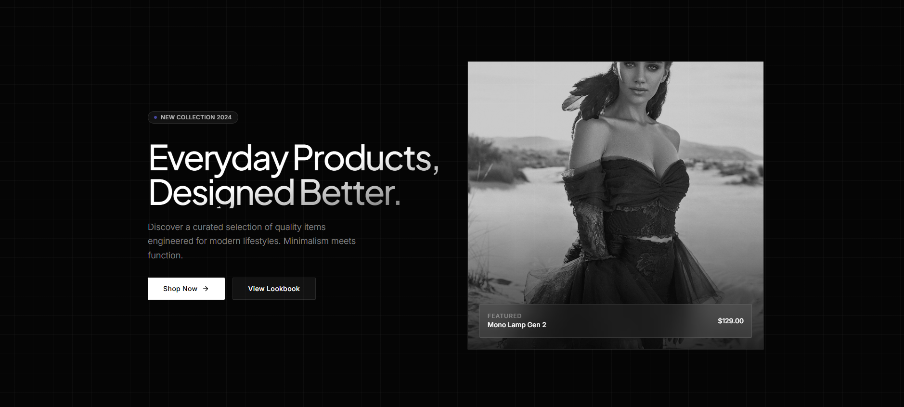

https://horizontetourteste.aura.build/
**What I like**: Clean structured site with nice pacing
**Use for**: Landing pages, SaaS sites

https://industrial-engineering-jin.aura.build/           
**What I like**: Clean structured site with nice orange accent color
**Use for**: agency minimal look
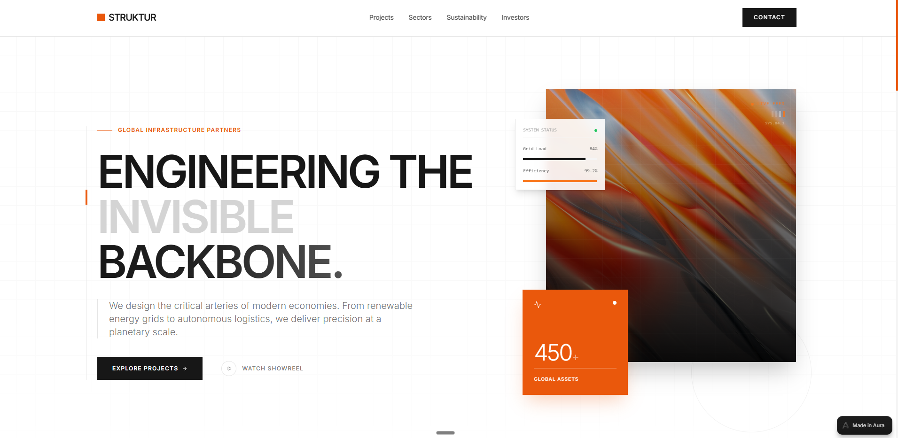

https://reboot-coaching.aura.build/           
**What I like**: Clear and concise site with nice orange accent color, very good hero section
**Use for**: minimal clear site
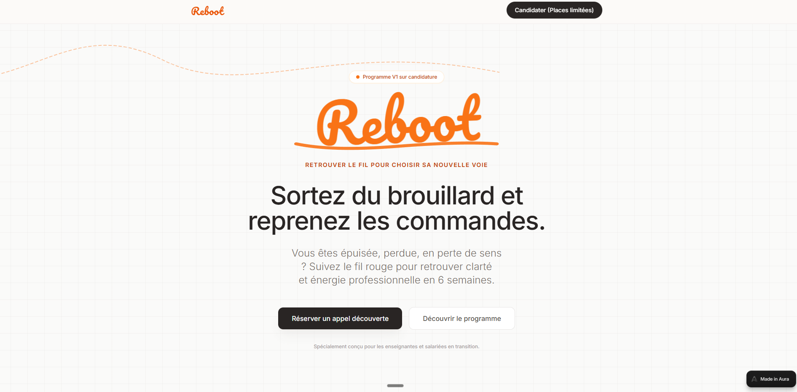

https://himanshu-portfolio.aura.build/           
**What I like**: very nice dark minimalistic designer portfolio with progess bar in the top and nice spacing adn features to use on the way down 
**Use for**: agency minimal look
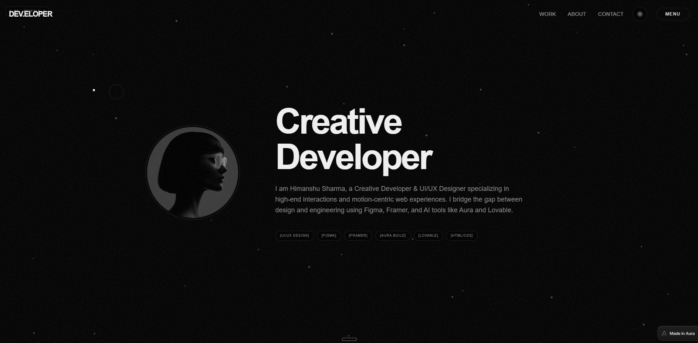

https://fintech-banking-30.aura.build/           
**What I like**: dark hero, with the rest of the site being white and clean
**Use for**: Saas/product page
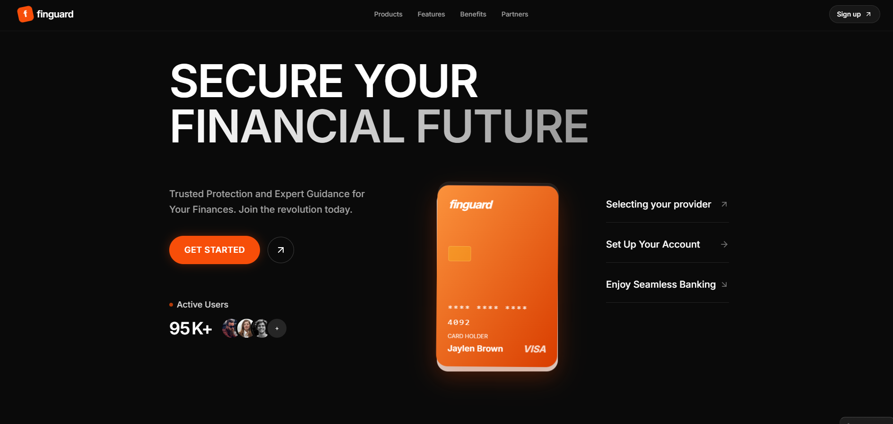

https://monospace-devops-57.aura.build/           
**What I like**: super clean UI look, white
**Use for**: Agency site
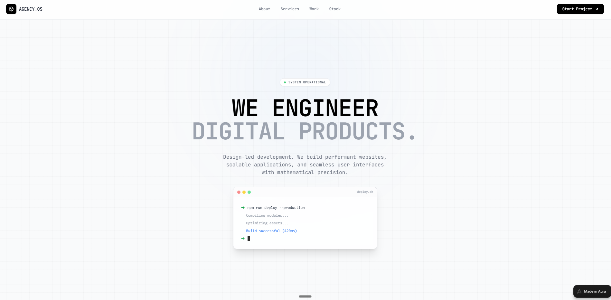

https://the-body-rhythm.aura.build/           
**What I like**: Very cool dark hero and clean dark look an feel on the site
**Use for**: Company/agency site
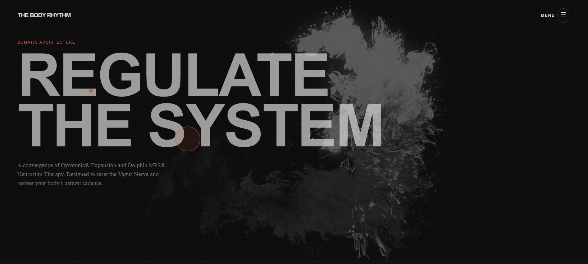

https://augen.pro/?ref=godly
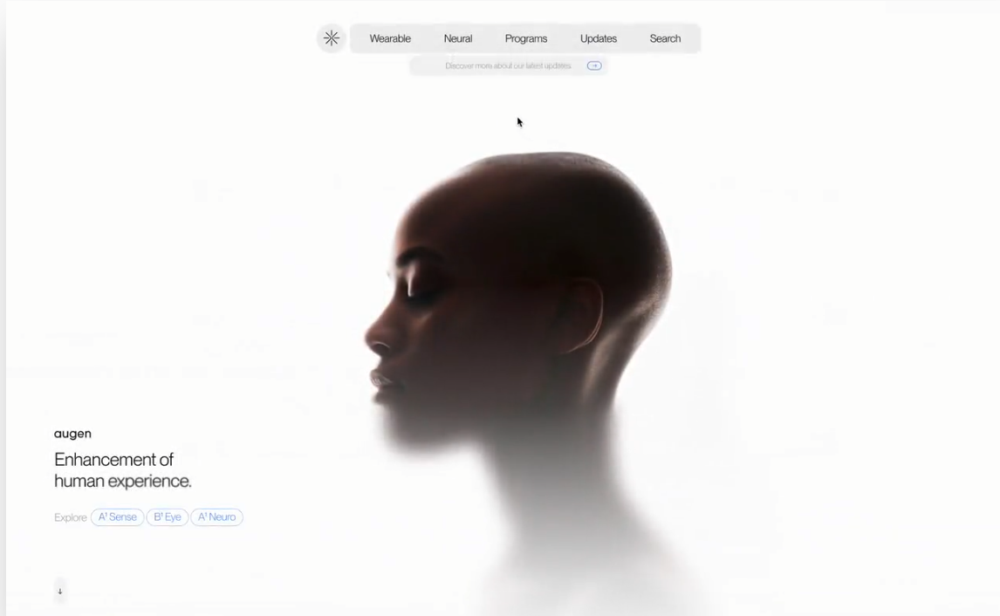
**What I like**: Ultra-minimal wearable tech site with "Invisible Computing" concept. Extremely clean typography, subtle animations, futuristic product showcase. Perfect spacing and restraint.
**Use for**: High-end tech products, minimal portfolio, futuristic brand sites

https://studionika.co/?ref=onepagelove
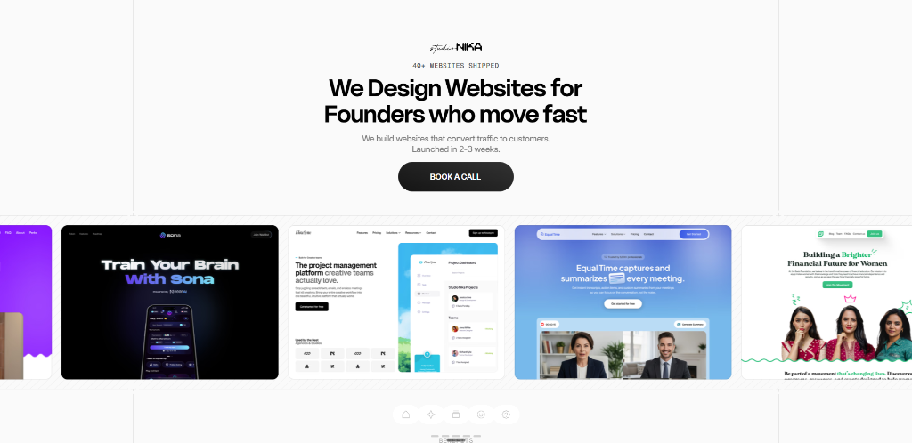
**What I like**: Clean white web design agency site. "We Design Websites for Founders who move fast" - bold typography, simple layout. Portfolio grid showcase of 40+ websites. Fast turnaround messaging (2-3 weeks). Very clear value proposition.
**Use for**: Agency sites, web design studios, service-based businesses